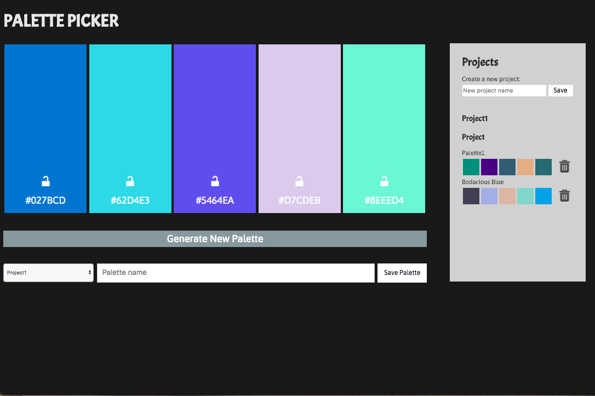

# Palette Picker

[Live Site](https://nyssas-rad-palette-picker.herokuapp.com/)

## About: 

Palette Picker is a school project. Based off the website Coolors, Palette Picker gives users the opportunity to generate random palettes and save and assign the palettes to specific projects.

## Tech Stack: 

JavaScript, jQuery, Node/Express, Chai, Mocha, Postgres, SQL

## Learning Goals: 

* Practice making a server using Express 
* Making API calls to my own server
* Testing the server side
* Utilizing a database to have data persist 

